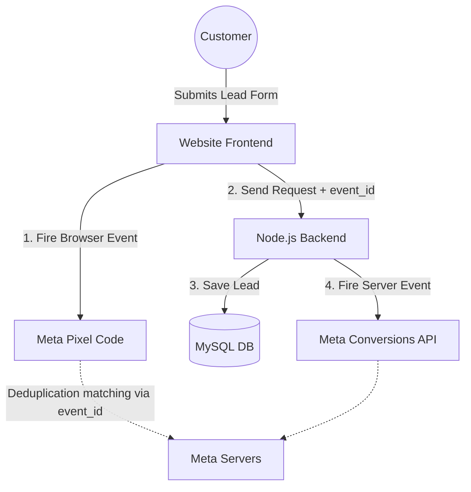

# EazyService Tracking & Conversions Setup Guide

This document outlines the **Advanced Tracking Architecture** implemented for EazyService. This setup combines the standard **Meta Pixel (Browser)** with the **Meta Conversions API (Server)** to ensure 100% accurate tracking on Hostinger Business Hosting.

---

## 🏗️ Architecture Overview

Since Hostinger's Shared Node.js environment does not support Docker, we have implemented a **Native Server-Side Tracking** system directly inside your backend (`server.ts`).

---

## 🛠️ Components of the Setup

### 1. Meta Pixel (Browser-side)
- **Automatic Injection**: Your server now automatically injects the official Meta Pixel snippet into the `<head>` of every page.
- **Dynamic Activation**: The script only loads if you have entered a `Meta Pixel ID` in your admin panel.
- **PageView**: Fires automatically on every page visit to build retargeting audiences.

### 2. Conversions API (Server-side)
- **Native Helper**: A custom function `sendMetaCAPIEvent` in `server.ts` handles the communication with Meta's Graph API.
- **Data Hashing**: As per Meta's security requirements, all customer data (Email, Phone) is hashed using **SHA-256** before being sent.
- **Hostinger Optimization**: Because this runs as part of your main Node.js process, it doesn't need external Docker containers or extra server costs.

### 3. Lead Event & Deduplication
- **The Challenge**: If both the browser and server send a "Lead" event, Meta might count them as two separate leads.
- **The Solution (Deduplication)**: 
    1. The frontend generates a unique `event_id` (e.g., `lead_171150000_x8y2`).
    2. The browser fires the event using this `event_id`.
    3. The server fires the same event using the *same* `event_id`.
    4. Meta sees both, matches them together, and treats them as **one single accurate lead**.

---

## ⚙️ Configuration Instructions

To activate the tracking on your live site, follow these steps:

### Step 1: Meta Pixel ID
1. Go to your **Meta Events Manager**.
2. Copy your **Pixel ID**.
3. Go to `EazyService Admin > Site Settings > Tracking`.
4. Paste the ID into the **Meta Pixel ID** field and Save.

### Step 2: Meta CAPI Access Token
1. In Meta Events Manager, go to **Settings**.
2. Scroll to **Conversions API** and click **"Generate access token"**.
3. Copy the long token string.
4. Go to `EazyService Admin > Site Settings > Tracking`.
5. Paste it into the **CAPI Access Token** field and Save.

---

## 🧪 How to Test It

1. **Test Browser Events**: Install the "Meta Pixel Helper" Chrome extension. Visit your site and submit a form; you should see a "Lead" event fire.
2. **Test Server Events**: 
    - In **Meta Events Manager**, go to **Test Events**.
    - Find your **Test Event Code** (e.g., `TEST12345`).
    - *Optional*: Add this code to the `test_event_code` parameter in the `server.ts` code temporarily if you want to see live payloads.
3. **Verify Deduplication**: Check the "Event Overview" in Meta. You should see events coming from "Multiple Sources" (Browser & Server) with an "Event Matching" score.

---

## 📂 Relevant Files in Your Project

- `server.ts`: Contains the `sendMetaCAPIEvent` logic and the lead route integration.
- `components/BookingForm.tsx`: Contains the deduplication ID generation and browser-side `fbq` call.
- `components/admin/SiteSettings.tsx`: The UI for managing your tracking IDs.
